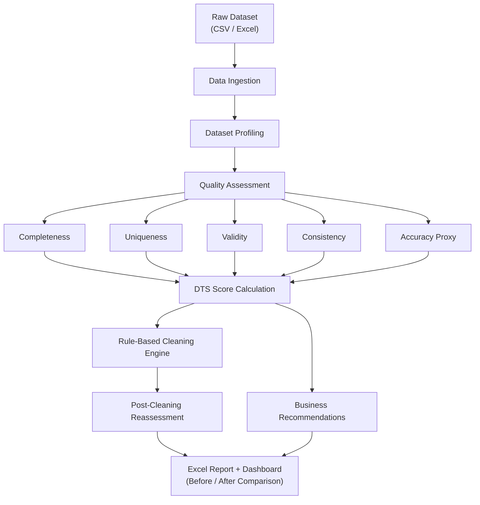

<div align="center">
# DATASTY

### AI Data Readiness & Quality Assessment Platform

*Profile. Score. Clean. Report. — Before your data ever reaches Analytics, BI, ML, or GenAI.*


**[🚀Don't read, TRY!](https://datasty.streamlit.app/)** · **[📂 Source Code](#project-structure)** · **[📊 Methodology](#how-the-dts-score-works)**

</div>

---

## Table of Contents

- [Overview](#overview)
- [Problem Statement](#problem-statement)
- [Why Data Quality Matters](#why-data-quality-matters)
- [Demo](#demo)
- [Key Features](#key-features)
- [How It Works](#how-it-works)
- [How the DTS Score Works](#how-the-dts-score-works)
- [Quality Dimensions Framework](#quality-dimensions-framework)
- [Project Structure](#project-structure)
- [Getting Started](#getting-started)
- [Configuration](#configuration)
- [Output Files](#output-files)
- [Tech Stack](#tech-stack)
- [Limitations](#limitations)
- [Roadmap](#roadmap)
- [What I Learned](#what-i-learned)
- [Contributing](#contributing)
- [License](#license)
- [Author](#author)

---

## Overview

**DaTasty** is an end-to-end data quality and readiness assessment platform built in Python and Streamlit.

Before a dataset is used for **Analytics, Business Intelligence, Machine Learning, or Generative AI**, DaTasty profiles it, audits it across five quality dimensions, scores it with a single composite metric (the **DTS — DaTasty Trust Score**), cleans it according to configurable rules, and generates an executive-ready Excel report — all in one run, with no code required from the end user.

> The core idea: **don't build dashboards or train models on data you haven't audited.** Find the problems before they find you.

---

## Problem Statement

Organizations collect data from spreadsheets, CRMs, ERPs, forms, APIs, and manual entry — and that data is routinely *assumed* to be correct without ever being audited.

Common questions teams struggle to answer quickly:

- Is this dataset complete enough to report on?
- Are there duplicate or conflicting records?
- Are values formatted consistently across the dataset?
- Can this data be trusted for a business decision?
- Is it ready to train a model — or to feed into an LLM pipeline?
- Out of everything wrong with this data, what should be fixed *first*?

Answering these manually is slow, inconsistent, and easy to skip under deadline pressure. Most commercial data-quality platforms that answer these questions are also expensive and out of reach for students, small teams, and individual analysts. DaTasty is an attempt to make a transparent, rules-based version of that workflow freely accessible.

---

## Why Data Quality Matters

| Domain | Impact of Poor Data Quality |
|---|---|
| **Analytics** | Incorrect dashboards and misleading KPIs |
| **Business Intelligence** | Business decisions made on inaccurate information |
| **Machine Learning** | Models trained on dirty data generalize poorly |
| **Generative AI** | LLMs and AI systems produce unreliable outputs when fed unreliable context |
| **Operations** | Duplicate and inconsistent records create manual rework and inefficiency |

The ceiling of any analysis — however sophisticated — is set by the quality of the data underneath it. DaTasty exists to raise that floor *before* the analysis starts.

---

## Demo

### Dashboard Home📸

*Upload interface — drop in a CSV or Excel file and run the full analysis with one click.*

### Quality Findings

*Filterable issue explorer across all five quality dimensions, with severity tagging.*

### Executive Summary

*Composite trust score, AI-readiness status, and dimension-level breakdown.*

*DTS score comparison showing measurable improvement after automated cleaning.*


### Quality Findings


### Recommendations

*Auto-generated, styled Excel workbook — ready to forward to a stakeholder.*

---

## Key Features

### 🔎 Dataset Profiling
Row count, column count, data types, memory usage, and per-column metadata — computed automatically on load.

### ✅ Multi-Dimensional Quality Assessment
Evaluates the dataset across the five DAMA-aligned data quality dimensions:

- **Completeness** — missing value detection per column
- **Uniqueness** — exact duplicate record detection
- **Validity** — format and range validation against configurable rules
- **Consistency** — formatting and casing inconsistencies across fields
- **Accuracy Proxy** — statistical outlier detection (IQR method) as a proxy for likely-incorrect values

> **Note:** True accuracy requires an external source of truth. DaTasty evaluates an *accuracy proxy* via anomaly detection rather than claiming ground-truth accuracy — this distinction is intentional and stated transparently in the scoring.

### 🎯 DaTasty Trust Score (DTS)
A single 0–100 composite score that summarizes overall dataset readiness, combining all five dimensions into one number you can track over time or compare across datasets.

### 🧹 Rule-Driven Automated Cleaning
Configurable, transparent cleaning operations: duplicate removal, string normalization (trim/case), phone number standardization, and date format correction — all driven by a single JSON rules file, not hardcoded logic.

### 📑 Executive Reporting
A styled, multi-sheet Excel report (Executive Summary, Dataset Profile, Quality Findings, Recommendations) generated automatically — formatted for a non-technical stakeholder to open and act on.

### 📊 Interactive Dashboard
A Streamlit interface that lets anyone upload a dataset, run the full pipeline, and explore results visually — zero code required.

---

## How It Works



The goal at every stage is the same: **surface issues clearly enough that a human can decide what to do about them.** DaTasty does not replace domain expertise — it gives domain experts a faster starting point.

---

## How the DTS Score Works

Each quality dimension produces a score out of 100 (`100 − average issue %` across all flagged columns). These are combined into the final DTS using fixed weights:

| Dimension | Weight | What It Measures |
|---|---|---|
| Completeness | 25% | % of missing values per column |
| Uniqueness | 20% | % of duplicate records in the dataset |
| Validity | 20% | % of values violating format/range rules |
| Consistency | 20% | % of formatting inconsistencies (casing, whitespace, etc.) |
| Accuracy Proxy | 15% | % of statistical outliers (IQR method) |

```
DTS Score = Σ (Dimension Score × Weight)
```

The final score maps to an AI-readiness status:

| DTS Score | Status |
|---|---|
| 90 – 100 | 🟢 AI Ready |
| 75 – 89 | 🟢 Good |
| 60 – 74 | 🟡 Needs Attention |
| Below 60 | 🔴 Not AI Ready |

The score isn't designed to *guarantee* correctness — it's designed to give a consistent, repeatable way to compare datasets and track measurable improvement before and after cleaning.

---

## Quality Dimensions Framework

| Dimension | Purpose |
|---|---|
| **Completeness** | Detect missing information |
| **Uniqueness** | Detect duplicate records |
| **Validity** | Detect invalid formats and out-of-range values |
| **Consistency** | Detect logical and formatting inconsistencies |
| **Accuracy Proxy** | Detect suspicious patterns and statistical anomalies |

Each dimension is evaluated independently, then combined into the single DTS score described above.

---

## Project Structure

```
DaTasty/
├── main.py                     # CLI entry point
├── requirements.txt            # Project dependencies
├── config/
│   └── rules.json               # Column-level validation & cleaning rules
├── src/
│   ├── engine.py                 # Orchestrates the full end-to-end pipeline
│   ├── ingestion/
│   │   └── loader.py             # CSV / Excel loading
│   ├── profiling/
│   │   └── profiler.py           # Dataset metadata & profiling
│   ├── quality/
│   │   ├── completeness.py
│   │   ├── uniqueness.py
│   │   ├── business_duplicates.py
│   │   ├── validity.py
│   │   ├── consistency.py
│   │   └── accuracy.py
│   ├── scoring/
│   │   └── dts_calculator.py     # DTS score engine
│   ├── recommendations/
│   │   └── advisor.py            # Business-impact recommendation generator
│   ├── cleaning/
│   │   └── smart_cleaner.py      # Rule-driven cleaning engine
│   └── reporting/
│       └── report_generator.py   # Styled Excel report generation
├── dashboard/
│   ├── app.py                    # Streamlit dashboard
│   ├── data_loader.py
│   ├── kpi.py
│   ├── charts.py
│   └── theme.py
├── scripts/
│   └── generate_benchmark.py     # Synthetic benchmark dataset generator
└── data/
    ├── input/                    # Sample datasets
    ├── benchmark/                 # Synthetic test/demo datasets
    └── output/                    # Generated reports & cleaned data
```
---

## Configuration

All validation and cleaning behavior is driven by `config/rules.json` — no logic needs to be hardcoded or changed in source files to support a new column.

```json
"Email": {
  "datatype": "email",
  "required": true,
  "cleaning": {
    "enabled": true,
    "pipeline": ["trim", "lower"]
  }
}
```

Supported rule types per column include:

- `datatype` checks (`numeric`, `email`, and more in progress)
- `required` and `business_key` flags
- `validation` constraints (`min`, `max`, regex `pattern`)
- `consistency` checks (formatting/casing)
- `cleaning` pipelines (`trim`, `lower`, `upper`, `title`)
- Phone number and date standardization rules

---

## Output Files

Every run generates outputs:

| File | Description |
|---|---|
| Excel Report | Full audit: profile, quality findings, DTS score, recommendations |
| Cleaned Dataset | Cleaned dataset after all enabled rules are applied |

---

## Tech Stack

- **Python** — core language
- **Pandas / NumPy** — data processing and statistical analysis
- **Streamlit** — interactive dashboard
- **Plotly** — charting and visualization
- **OpenPyXL** — styled Excel report generation
- **Scikit-learn** — supporting analytical utilities

---

## Limitations

DaTasty is currently designed for **structured, tabular datasets** and works best with clearly defined columns (e.g. customer IDs, names, emails, phone numbers, dates, locations, transaction data).

- **Limited domain knowledge** — the platform does not infer industry-specific business rules automatically; rules must be configured.
- **No external verification** — true accuracy (vs. an accuracy *proxy*) requires a trusted external reference source, which is out of scope today.
- **Rule-based cleaning only** — cleaning logic follows predefined rules rather than adaptive or ML-based correction.
- **Structured data only** — unstructured inputs (PDFs, images, audio, free text) are not supported.
- **Single dataset analysis** — no cross-system or cross-dataset reconciliation yet.

---

## Roadmap

- [ ] Custom business rule engine
- [ ] Industry-specific validation templates
- [ ] Reference-data integration for true accuracy checks
- [ ] Multi-dataset reconciliation
- [ ] Data lineage tracking
- [ ] Broader data governance features
- [ ] API integration
- [ ] Real-time monitoring
- [ ] User authentication and access control
- [ ] Cloud-native deployment architecture

---

## What I Learned

This project was built as a hands-on way to understand real-world data quality challenges from the ground up, including:

- Practical data profiling techniques
- Designing and implementing multi-dimensional data quality checks
- Building a composite scoring model (DTS) and justifying its weighting
- Rule-driven cleaning systems vs. hardcoded one-off fixes
- Automated report generation for non-technical stakeholders
- Dashboard development with Streamlit and Plotly
- Structuring a modular Python project rather than a single script
- Generating realistic synthetic benchmark data for testing
- Translating technical findings into business-friendly language and recommendations

The single biggest takeaway: **cleaning and validating data is consistently harder and more time-consuming than the modeling or reporting that follows it** — and it's the step most often skipped.

---

## Contributing

Contributions, suggestions, and feedback are welcome. To extend the platform:

- Add new quality checks under `src/quality/`
- Extend scoring logic in `src/scoring/dts_calculator.py`
- Enhance reporting in `src/reporting/report_generator.py`

Feel free to open an issue or submit a pull request.

---

## License

This project is licensed under the **MIT License** — see [LICENSE](LICENSE) for details.

---

## Author

**Dhiren Walia**

Aspiring Data Analyst · BBA Student

[GitHub](https://github.com/DhirenWalia) · [LinkedIn](#) · [Live Demo](https://datasty.streamlit.app/)

⭐ If this project was useful or interesting, consider starring the repo — it helps a lot.
